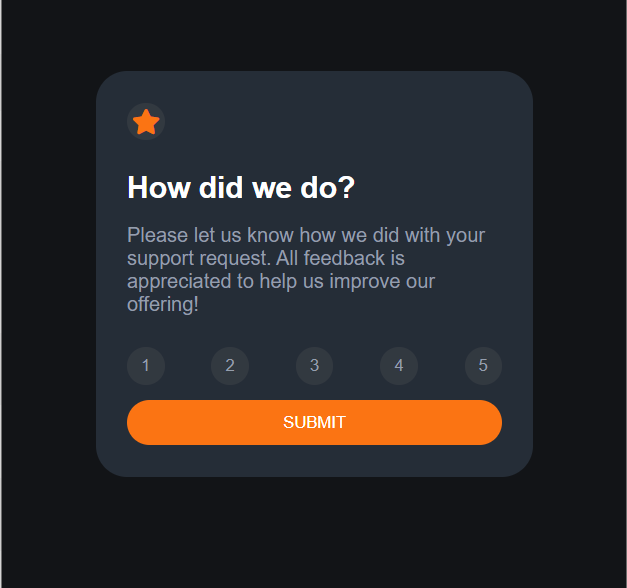
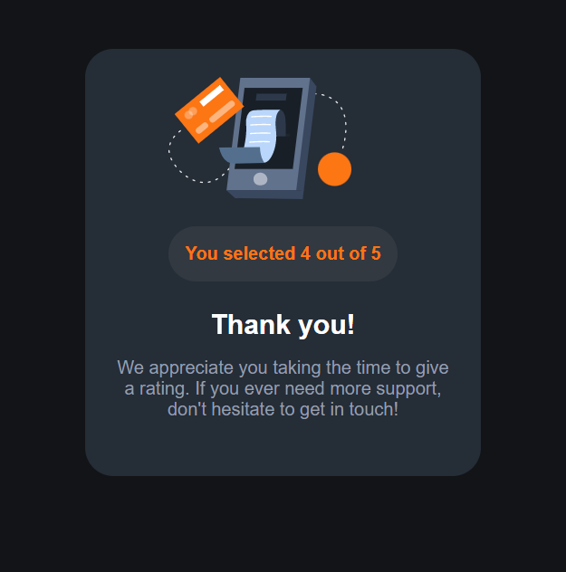

# Interactive rating component

> This is a nice, small project to practice handling user interactions and updating the DOM.
> This is a solution to the [Interactive Rating Component challenge on Frontend Mentor](https://www.frontendmentor.io/challenges/interactive-rating-component-koxpeBUmI).

## Preview

| Rating Page | Submitted Page |
|-------------|----------------|
|||

## Built With

- HTML
- CSS
- JavaScript

## Live Demo

[Live Demo Link](https://livedemo.com)

## Getting Started

To get a local copy up and running follow these simple example steps.

### Prerequisites
- VS code or any code editor

### Setup
$ mkdir yourFolder
$ cd yourFolder
$ Run `git clone git@github.com:chaw-bot/interactive-rating-component.git`

👤 **Author**

- GitHub: [@chaw-bot](https://github.com/chaw-bot)
- Twitter: [@chaw](https://twitter.com/chawfronaut)
- LinkedIn: [Chawanzi Ng'uni](https://linkedin.com/in/chawanzi-ng-uni)

## 🤝 Contributing

Contributions, issues, and feature requests are welcome!

Feel free to check the [issues page](https://github.com/chaw-bot/interactive-rating-component/issues).

## Show your support

Give a ⭐️ if you like this project!

## Acknowledgments

- Hat tip to [Frontend Mentor](https://www.frontendmentor.io/solutions) for the challenge and the template provided.
- Inspiration
- etc

## 📝 License

This project is [MIT](./MIT.md) licensed.
